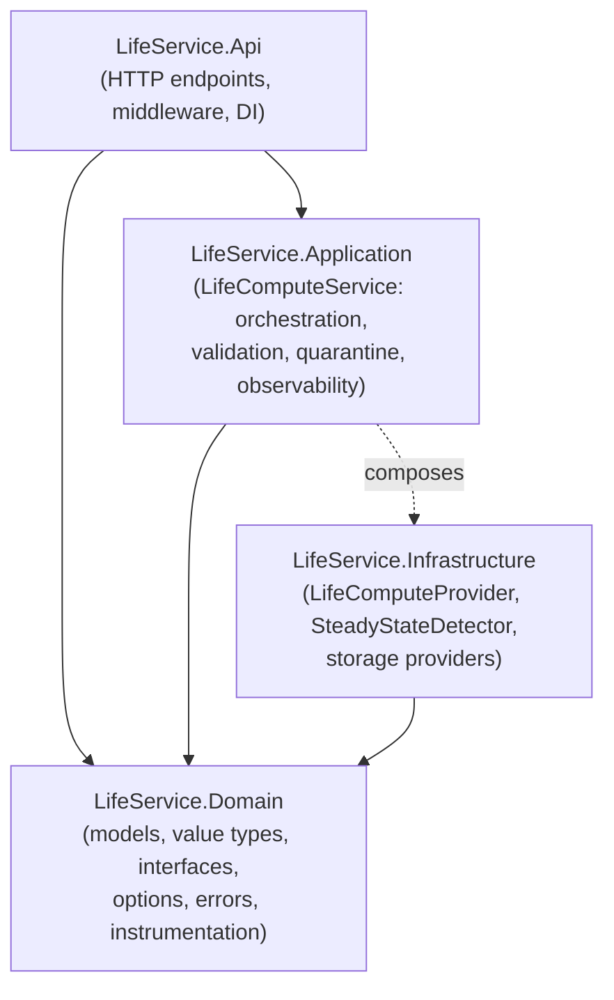
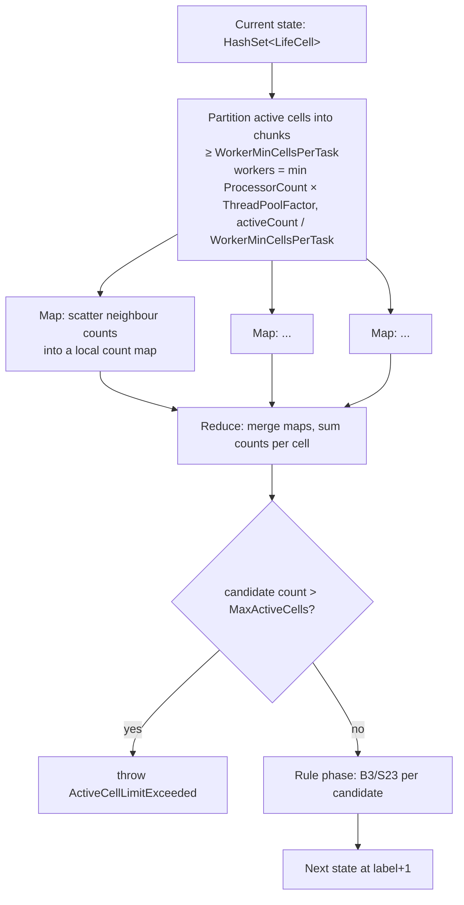
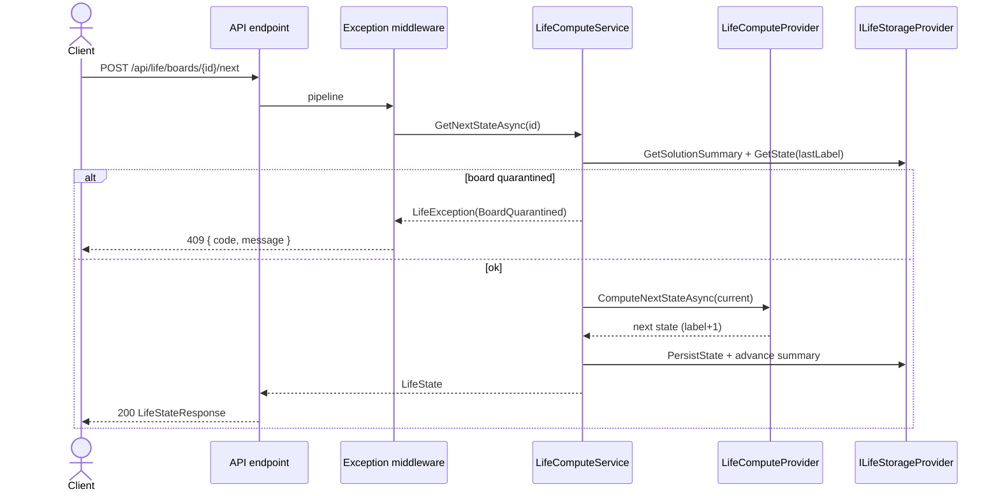

# LifeService — Conway's Game of Life

A production-oriented, scalable Conway's Game of Life web service built on **.NET 10 / ASP.NET Core**
using **clean architecture**. It provides a deterministic compute engine, persistent solutions,
steady-state / oscillation detection, quarantining of failing boards, and full observability
(logging, metrics, tracing).

> This document is the generated architecture documentation. It is kept synchronized with the code
> and reflects the authoritative blueprint in [`SYSTEM_SPECIFICATION.md`](SYSTEM_SPECIFICATION.md).
> Deep-dive companions: [`docs/engine.md`](docs/engine.md),
> [`docs/persistence.md`](docs/persistence.md), [`docs/observability.md`](docs/observability.md).

---

## 1. System Overview

A board is a sparse set of live cells on a conceptually infinite grid. Clients upload an initial
state, then drive the simulation forward one generation at a time, in batches, or all the way to a
detected steady state. Each generation is labelled with a monotonically increasing
`LifeStateLabel` (label `0` is the uploaded state). Boards that repeatedly fail are quarantined and
rejected until explicitly cleared.

| Concern | Choice |
| --- | --- |
| Language / runtime | C# / .NET 10 (ASP.NET Core Minimal APIs) |
| Architecture | Clean architecture: Domain ← Application ← Infrastructure ← API |
| Compute | Deterministic map/reduce engine over a sparse cell set |
| Persistence (dev) | In-memory provider (default); SQLite for relational dev |
| Persistence (prod) | SQL/NoSQL (SQL Server, PostgreSQL, Cosmos DB, DynamoDB) + optional Redis |
| Observability | `ILogger<T>`, `System.Diagnostics.Metrics`, `ActivitySource` (`GameOfLife.Engine`) |
| Tests | xUnit unit + integration (`WebApplicationFactory`) |

---

## 2. Component Boundaries

Dependencies point inward. The Domain has no dependencies; outer layers depend only on
abstractions defined in the Domain.



| Layer | Project | Responsibility |
| --- | --- | --- |
| **Domain** | `LifeService.Domain` | `BoardId`, `LifeCell`, `LifeStateLabel`, `LifeState`, `SolutionSummary`, `QuarantineInfo`; interfaces `ILifeComputeService`/`ILifeComputeProvider`/`ILifeStorageProvider`; options; `LifeErrorCode`/`LifeException`; metrics + activity source. |
| **Application** | `LifeService.Application` | `LifeComputeService` — validation, quarantine gating/retry, persistence, observability. |
| **Infrastructure** | `LifeService.Infrastructure` | `LifeComputeProvider` (map/reduce), `SteadyStateDetector`, `InMemoryLifeStorageProvider`. |
| **API** | `LifeService.Api` | Minimal API endpoints under `/api/life`, global exception middleware, `/health`, DI + options binding. |

---

## 3. Compute Engine Flow (Map / Reduce)

The engine computes the next generation from a sparse representation using a map/reduce model.
See [`docs/engine.md`](docs/engine.md) for the full algorithm and tuning.



**Rules (per cell):** survive on 2–3 live neighbours; a dead cell is born on exactly 3. Input state
is never mutated; output is deterministic regardless of how the active cells are partitioned (count
summation is order-independent).

### Steady-state detection

`ComputeUntilSteadyOrLimitAsync` iterates the engine while a `SteadyStateDetector` records a
**translation-invariant canonical key** for each state against the label it was first seen at. On
recurrence:

- **period == 1** → `StableSteadyState` (still life or empty board),
- **period > 1** → `OscillationSteadyState` (period = `currentLabel − firstSeenLabel`),
- limit reached without recurrence → `Incomplete`.

It returns a `SteadyStateResult` carrying the summary **and** the computed trajectory; the service
persists those states (so `LastComputedLabel` always refers to a stored state and the full history is
queryable via `/states`).

---

## 4. Data Flow (Request Lifecycle)



---

## 5. API Surface

Base route: `/api/life/boards`. All errors return a deterministic `{ "code", "message" }` envelope
with no stack traces.

| # | Method & route | Description | Success | Error codes |
| --- | --- | --- | --- | --- |
| 1 | `POST /api/life/boards` | Upload initial board (idempotent by content) | `201 Created` `{ boardId }`, or `200 OK` `{ boardId }` if an identical board already exists | `ActiveCellLimitExceeded` (422) |
| 1b | `GET /api/life/boards?page=&pageSize=` | List the first state (label 0) of every stored board, in creation order, paginated | `200` `{ items, page, pageSize, totalCount }` (each item has `boardId, label, activeCells, createdAt`) | `InvalidRange` (400), `StatesLimitExceeded` (422) |
| 2 | `POST /api/life/boards/{boardId}/next` | Advance one generation | `200` state | `BoardNotFound` (404), `BoardQuarantined` (409) |
| 3 | `GET /api/life/boards/{boardId}/final` | Compute to steady state / limit | `200` summary | `BoardNotFound`, `BoardQuarantined` |
| 4 | `POST /api/life/boards/{boardId}/next-sequence?n=` | Advance N generations | `200` states | `StatesLimitExceeded` (422) |
| 5 | `GET /api/life/boards/{boardId}/states?from=&to=` | Persisted states in range | `200` states | `InvalidRange` (400) |
| 6 | `GET` / `DELETE /api/life/boards/{boardId}/quarantine` | Inspect / clear quarantine | `200`/`204` | — |

`GET /health` exposes a liveness probe.

**Listing stored boards.** `GET /api/life/boards` returns one record per stored board — its **first**
state (label 0, the uploaded initial state) with `boardId`, `label`, `activeCells` and `createdAt` —
in **creation order** (oldest first), backed by a monotonic per-board creation sequence. Paginate via
`page` (1-based, default 1) and `pageSize` (default 50, capped at `MaxStatesPerRequest`); the response
includes `totalCount` for paging.

**Idempotent uploads.** Boards are content-addressed by a fingerprint of their exact initial cell
set (`BoardFingerprint` — order-independent and duplicate-free, but not translation-invariant).
Re-uploading the same cells returns the existing board id (`200 OK`) instead of creating a duplicate;
a translated copy is treated as a distinct board. All later operations then act on that board's
current state set.

---

## 6. Persistence Model

The persistence boundary is `ILifeStorageProvider` (boards, states, solution summaries, quarantine
records). All writes are idempotent upserts. Details in [`docs/persistence.md`](docs/persistence.md).

- **Development:** `InMemoryLifeStorageProvider` (default, thread-safe) or file-based SQLite.
- **Production:** relational (SQL Server / PostgreSQL) or NoSQL (Cosmos DB / DynamoDB), with optional
  Redis for quarantine and solution-summary caching.

---

## 7. Observability Model

Full reference in [`docs/observability.md`](docs/observability.md).

- **Logging** — `ILogger<T>` structured logs carrying `boardId`, `operation`, `status`, `durationMs`;
  per-request scopes; quarantine events logged with reason and context.
- **Metrics** (`System.Diagnostics.Metrics`, meter `GameOfLife.Engine`):
  `states_computed` (Counter), `active_cells` (UpDownCounter), `quarantined_boards` (Counter).
- **Tracing** — `ActivitySource` `GameOfLife.Engine`, with `boardId` and `operation` tags.

---

## 8. Domain Invariants & Failure Modes

| Invariant | Enforcement |
| --- | --- |
| State transitions are deterministic | Pure rule evaluation; partition-independent reduce |
| Input state is never mutated | `LifeState` copies its cells defensively; engine reads a `HashSet` snapshot |
| Quarantined boards are logged and counted | `quarantined_boards` counter + structured error/warning logs |
| Persistence operations are idempotent | Upsert semantics in the storage provider |
| Board creation is idempotent by content | Boards keyed by `BoardFingerprint`; identical uploads return the existing id (in-memory index / unique fingerprint column) |
| Observability present in all compute operations | Activity span + metrics + scoped logs per operation |

**Failure modes:** invalid/oversized input → `ActiveCellLimitExceeded` / `StatesLimitExceeded`;
bad ranges → `InvalidRange`; unknown board → `BoardNotFound`; repeated unexpected failures →
the board is quarantined after `MaxRetriesPerBoard` and subsequently returns `BoardQuarantined`
until cleared; any other unexpected error → `InternalError` (500) with no stack-trace leakage.

---

## 9. Configuration

Bound from `appsettings.json` under `Life` (see [`SYSTEM_SPECIFICATION.md`](SYSTEM_SPECIFICATION.md) §6).

```json
{
  "Life": {
    "Limits":  { "MaxActiveCells": 10000, "MaxStatesPerRequest": 1000, "MaxRetriesPerBoard": 3 },
    "Compute": { "WorkerMinCellsPerTask": 128, "ThreadPoolFactor": 2.0 },
    "Storage": { "UseRedisQuarantine": true, "UseRedisSolutionCache": false }
  }
}
```

---

## 10. Building, Running & Testing

```bash
# from the repository root
dotnet build                 # build the solution (LifeService.slnx)
dotnet test                  # run unit + integration tests
dotnet run --project src/LifeService.Api   # serve the API (OpenAPI at /openapi in Development)
```

For local configuration, running, and end-to-end client request/response examples, see
[`docs/usage.md`](docs/usage.md). A ready-to-run request collection lives in
[`src/LifeService.Api/LifeService.Api.http`](src/LifeService.Api/LifeService.Api.http).

### Project layout

```
src/
  LifeService.Domain          # models, interfaces, options, errors, instrumentation
  LifeService.Application     # LifeComputeService (orchestration)
  LifeService.Infrastructure  # compute engine + steady-state detector + storage
  LifeService.Api             # HTTP endpoints, middleware, DI
tests/
  LifeService.Tests.Unit          # rules, steady-state, limits, quarantine, property-based
  LifeService.Tests.Integration   # API + infrastructure end-to-end
```

### Continuous integration & git hooks

- **CI:** `.github/workflows/ci.yml` runs `dotnet restore`/`build`/`test` (Release) on every push to
  `master` and on every pull request.
- **Pre-commit hook:** `.githooks/pre-commit` runs the test suite before each commit. Activate it
  once per clone:

  ```bash
  git config core.hooksPath .githooks
  ```

  Bypass for a single commit (sparingly) with `git commit --no-verify`.
