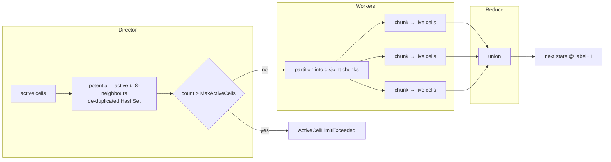

# Compute Engine — Director / Worker Model

The compute engine (`LifeService.Infrastructure.Compute.LifeComputeProvider`) implements the
deterministic director/worker design from [`SYSTEM_SPECIFICATION.md`](../SYSTEM_SPECIFICATION.md) §8–§9.

## Sparse representation

A board is a set of live cells (`HashSet<LifeCell>`), not a dense grid — memory and compute scale
with the number of live cells, not the bounding box. The grid is conceptually infinite; coordinates
are signed 32-bit integers.

## Pipeline



### 1. Director phase
Builds the **potential set** — every active cell plus its eight neighbours — de-duplicated in a
`HashSet`. Only these cells can possibly be alive next generation, so the rest of the infinite grid
is ignored. If `potential.Count > MaxActiveCells`, the engine throws `ActiveCellLimitExceeded`.

### 2. Worker phase
The potential set is materialised into a list and partitioned into **disjoint** chunks:

- worker count `T = max(1, ProcessorCount × ThreadPoolFactor)`;
- each chunk has at least `WorkerMinCellsPerTask` cells;
- boards with `≤ WorkerMinCellsPerTask` potential cells run single-threaded (no scheduling overhead).

Each worker evaluates the Game of Life rule for its cells using **read-only lookups** into the shared
active set:

```
liveNext = isAlive ? (neighbours == 2 || neighbours == 3)   // survival
                   : (neighbours == 3);                       // birth
```

### 3. Reduce phase
Worker outputs are concatenated. Because chunks are disjoint partitions of distinct potential cells,
**no two workers can emit the same cell** — there are no write conflicts and no de-duplication is
required. The result is the next `LifeState` at `label + 1`.

## Determinism & safety

- **No input mutation** — the engine copies the incoming cells into a local `HashSet`; `LifeState`
  itself stores a defensive read-only copy.
- **Determinism** — the output set is independent of how the potential cells are partitioned across
  workers, so results are reproducible regardless of `ThreadPoolFactor` or core count.

## Steady-state detection (`SteadyStateDetector`)

A **canonical key** is computed per state: live cells are translated so the minimum X and Y are 0,
sorted, and serialised. This makes the key translation-invariant. The detector maps each key to the
label at which it was first observed.

| Observation | Result |
| --- | --- |
| Key unseen | record `key → label`, continue |
| Key seen, `label − firstSeen == 1` | `StableSteadyState` (still life / empty board) |
| Key seen, `label − firstSeen > 1` | `OscillationSteadyState`, period = `label − firstSeen` |
| `maxStates` reached, no recurrence | `Incomplete` |

> **Note on spaceships:** because the canonical key is translation-invariant, a translating pattern
> (e.g. a glider) repeats its *shape* and is reported as an oscillation of the corresponding period.
> Patterns that never repeat their shape run until the `MaxStatesPerRequest` limit and report
> `Incomplete`.

## Configuration (`Life:Compute`)

| Option | Default | Effect |
| --- | --- | --- |
| `WorkerMinCellsPerTask` | 128 | Minimum chunk size; below this the board runs single-threaded |
| `ThreadPoolFactor` | 2.0 | Multiplier on `ProcessorCount` for the worker cap |

`MaxActiveCells` (`Life:Limits`, default 10000) bounds the potential-set size per generation.
