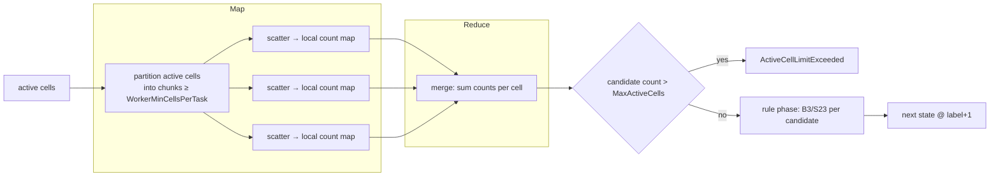

# Compute Engine — Map / Reduce Model

The compute engine (`LifeService.Infrastructure.Compute.LifeComputeProvider`) implements the
deterministic map/reduce design from [`SYSTEM_SPECIFICATION.md`](../SYSTEM_SPECIFICATION.md) §8–§9.

## Sparse representation

A board is a set of live cells (`HashSet<LifeCell>`), not a dense grid — memory and compute scale
with the number of live cells, not the bounding box. The grid is conceptually infinite; coordinates
are signed 32-bit integers.

## Pipeline



### 1. Map (scatter) phase
The active cells are materialised into a list and partitioned into chunks:

- worker count `T = min(max(1, ProcessorCount × ThreadPoolFactor), activeCount / WorkerMinCellsPerTask)`;
- each chunk has at least `WorkerMinCellsPerTask` cells (floor division guarantees it);
- boards with `< 2 × WorkerMinCellsPerTask` active cells run single-threaded (no scheduling overhead).

Each worker scatters into its **own local** `Dictionary<LifeCell, int>`: for every active cell, it
increments the neighbour count of each of the cell's eight neighbours. Workers share no mutable
state, so the map phase is conflict-free.

### 2. Reduce phase
The per-worker count maps are merged by **summing** the counts for each cell. Summation is
associative and commutative, so the merged map is independent of how the active cells were
partitioned. If the merged candidate count exceeds `MaxActiveCells`, the engine throws
`ActiveCellLimitExceeded`.

### 3. Rule phase
Each `(cell, count)` in the merged map is evaluated with **one** active-set lookup:

```
liveNext = isAlive ? (neighbours == 2 || neighbours == 3)   // survival
                   : (neighbours == 3);                       // birth
```

A live cell with no live neighbours never appears as a key in the map, so it correctly dies. The
surviving/born cells form the next `LifeState` at `label + 1`.

## Determinism & safety

- **No input mutation** — the engine copies the incoming cells into a local `HashSet`; `LifeState`
  itself stores a defensive read-only copy.
- **Determinism** — merged neighbour counts (and therefore the output set) are independent of how
  the active cells are partitioned across workers, so results are reproducible regardless of
  `ThreadPoolFactor` or core count.

## Steady-state detection (`SteadyStateDetector`)

A **canonical key** is computed per state: live cells are translated so the minimum X and Y are 0,
sorted, and serialised. This makes the key translation-invariant. The detector maps each key to the
label at which it was first observed.

| Observation | Result |
| --- | --- |
| Key unseen | record `key → label`, continue |
| Key seen, `label − firstSeen == 1` | `StableSteadyState` (still life / empty board) |
| Key seen, `label − firstSeen > 1` | `OscillationSteadyState`, period = `label − firstSeen` |
| `maxStates` reached, no recurrence | `Incomplete` |

> **Note on spaceships:** because the canonical key is translation-invariant, a translating pattern
> (e.g. a glider) repeats its *shape* and is reported as an oscillation of the corresponding period.
> Patterns that never repeat their shape run until the `MaxStatesPerRequest` limit and report
> `Incomplete`.

## Configuration (`Life:Compute`)

| Option | Default | Effect |
| --- | --- | --- |
| `WorkerMinCellsPerTask` | 128 | Minimum active cells per worker; below `2×` this the board runs single-threaded |
| `ThreadPoolFactor` | 2.0 | Multiplier on `ProcessorCount` for the worker cap |

`MaxActiveCells` (`Life:Limits`, default 10000) bounds the merged candidate count per generation.
