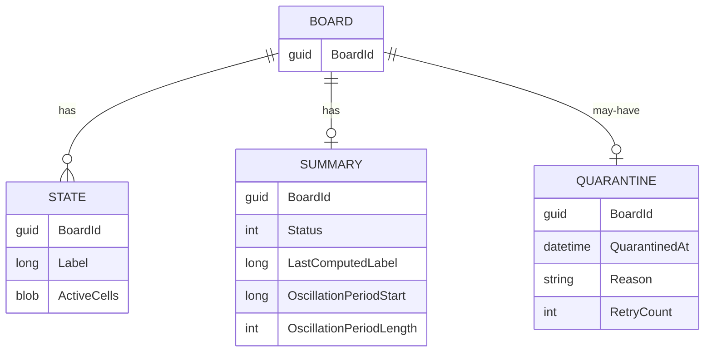

# Persistence Model

Persistence is abstracted behind `LifeService.Domain.Abstractions.ILifeStorageProvider`. The
Application layer depends only on this interface, so storage technology is a deployment choice
(see [`SYSTEM_SPECIFICATION.md`](../SYSTEM_SPECIFICATION.md) §5.3, and `CLAUDE.md` §4).

## The storage boundary

```csharp
public interface ILifeStorageProvider
{
    Task<BoardId> CreateBoardAsync(IReadOnlyCollection<LifeCell> initialState, CancellationToken ct);
    Task<LifeState?> GetStateAsync(BoardId boardId, LifeStateLabel label, CancellationToken ct);
    Task<IReadOnlyList<LifeState>> GetStatesRangeAsync(BoardId boardId, LifeStateLabel from, LifeStateLabel to, CancellationToken ct);
    Task PersistStateAsync(LifeState state, CancellationToken ct);
    Task<SolutionSummary?> GetSolutionSummaryAsync(BoardId boardId, CancellationToken ct);
    Task PersistSolutionSummaryAsync(SolutionSummary summary, CancellationToken ct);
    Task<QuarantineInfo?> GetQuarantineAsync(BoardId boardId, CancellationToken ct);
    Task PersistQuarantineAsync(QuarantineInfo info, CancellationToken ct);
    Task ClearQuarantineAsync(BoardId boardId, CancellationToken ct);
}
```

### Idempotency
Every write is an **upsert** keyed by its natural identity (`BoardId` + `LifeStateLabel` for states;
`BoardId` for summaries and quarantine records). Re-persisting the same state or summary is a no-op
in effect, satisfying the idempotency invariant.

### Conceptual data model



## Providers

### Development — in-memory (default)
`InMemoryLifeStorageProvider` stores boards in a thread-safe `ConcurrentDictionary`. It is the
registered default (`AddLifeInfrastructure`) and backs both local runs and the integration tests.
No external dependencies, no durability across restarts.

### Development — SQLite (relational)
`EfLifeStorageProvider` (backed by `LifeDbContext`, `Microsoft.EntityFrameworkCore.Sqlite`) is a
durable, file-based relational store. The EF model is provider-agnostic — the sparse cell set is
stored as JSON in a `CellsJson` column, so the same `DbContext` works against SQLite (dev) and a
production relational engine. The schema is created at startup via `EnsureCreatedAsync`
(`IServiceProvider.InitializeLifeStorageAsync`).

`appsettings.Development.json` enables it by default, so `dotnet run` uses `Data Source=life.db`:

```json
{ "Life": { "Storage": { "Provider": "Sqlite", "SqliteConnectionString": "Data Source=life.db" } } }
```

EF tables: `States` (PK `BoardId`+`Label`), `Summaries` (PK `BoardId`), `Quarantines` (PK `BoardId`).

### Production
Swap the registration in `AddLifeInfrastructure` for the chosen backend:

| Backend | Notes |
| --- | --- |
| SQL Server / PostgreSQL | EF Core relational provider; states stored per `(BoardId, Label)`. |
| Cosmos DB / DynamoDB | NoSQL document per board or per state; partition on `BoardId`. |
| Redis (optional) | Cache for quarantine (`UseRedisQuarantine`) and solution summaries (`UseRedisSolutionCache`). |

### Selecting a provider

`AddLifeInfrastructure` chooses the provider from configuration — no code change required:

| `Life:Storage:Provider` | Registration | Lifetime |
| --- | --- | --- |
| `InMemory` (default) | `InMemoryLifeStorageProvider` | Singleton (state survives across requests) |
| `Sqlite` | `LifeDbContext` + `EfLifeStorageProvider`, `UseSqlite(Life:Storage:SqliteConnectionString)` | Scoped (per request) |

Because the EF provider is request-scoped, `ILifeComputeService` is registered as **scoped** to avoid
a captive dependency; the stateless `ILifeComputeProvider` and the metrics meter remain singletons.

To add a production backend (SQL Server, PostgreSQL, Cosmos DB, DynamoDB), extend the provider switch
in `LifeService.Infrastructure/DependencyInjection.cs`. The `Life:Storage` options
(`UseRedisQuarantine`, `UseRedisSolutionCache`) select optional Redis caching layers without changing
the Application layer.
